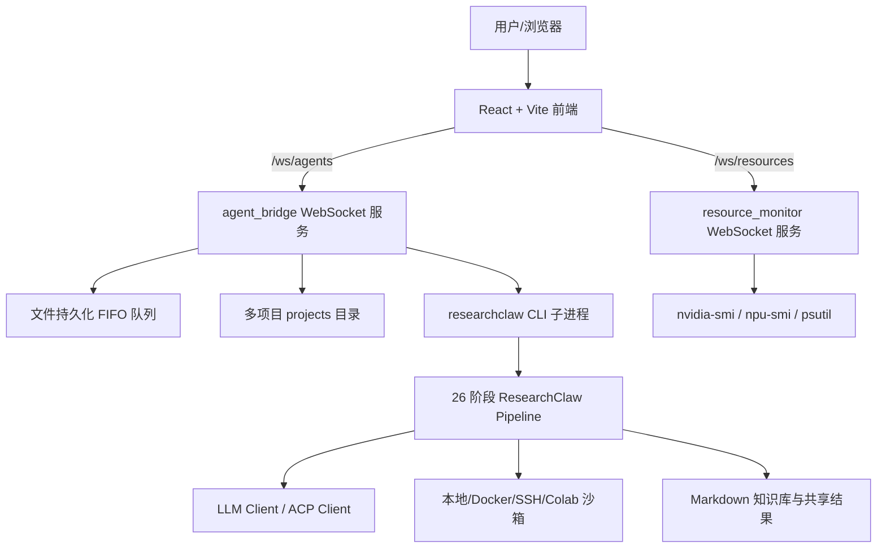

# Claw AI Lab 技术文档：Agent 工程师面试版

> 面向 Agent 工程师面试准备。本文基于当前仓库源码整理，重点解释系统架构、核心 agent 流水线、LLM 调用、工具执行、实验沙箱、前后端通信、工程亮点与可改进点。  
> 仓库路径：`/root/Claw-AI-Lab`

## 1. 项目定位

Claw AI Lab 是一个“自治多 Agent 科研实验室”平台。用户输入一个研究主题后，系统会自动完成从课题拆解、文献检索、知识综合、假设生成、实验设计、代码生成、实验执行、结果分析到论文写作与导出的端到端流程。

它不是单个 Chatbot，而是一个由 Python agent pipeline、WebSocket 调度服务、实验执行沙箱、共享知识库、前端控制台组成的完整 agentic system。

核心目标：

- 从一个 prompt 自动生成科研项目产物：论文、代码、图表、实验日志、引用验证报告。
- 支持多项目并行，通过 FIFO 队列和五层 agent 池调度任务。
- 支持人类在环，可以随时注入反馈、暂停、恢复、重启、删除项目。
- 支持不同 LLM Provider，包括 OpenAI-compatible、OpenRouter、DeepSeek、Anthropic、ACP agent。
- 支持本地数据集、checkpoint、代码库路径，让 agent 生成可运行实验代码。

## 2. 技术栈总览

后端：

- Python 3.11+
- 核心包：`backend/agent/researchclaw`
- WebSocket 服务：`backend/services/agent_bridge.py`、`backend/services/resource_monitor.py`
- CLI 入口：`researchclaw = researchclaw.cli:main`
- 主要依赖：`pyyaml`、`rich`、`arxiv`、`numpy`、`httpx`、`crawl4ai`、`tavily-python`、`exa-py`、`PyMuPDF`、`matplotlib`、`scipy`、`huggingface-hub`

前端：

- React + TypeScript + Vite
- 旧主控 UI：`frontend`
- 新版 Web UI：`frontend-web`
- WebSocket 代理配置：`frontend/vite.config.ts`、`frontend-web/vite.config.ts`

运行脚本：

- `./start.sh`：启动旧主控 UI，默认前端端口 `5903`
- `./start-web.sh`：启动新版前端，默认前端端口 `5910`
- 两个脚本都会启动：
  - `resource_monitor`，默认 `8905`
  - `agent_bridge`，默认 `8906`

## 3. 代码结构速览

```text
Claw-AI-Lab/
├── README.md
├── start.sh
├── start-web.sh
├── examples/config_template.yaml
├── backend/
│   ├── agent/
│   │   ├── pyproject.toml
│   │   ├── researchclaw/
│   │   │   ├── cli.py
│   │   │   ├── config.py
│   │   │   ├── pipeline/
│   │   │   │   ├── stages.py
│   │   │   │   ├── contracts.py
│   │   │   │   ├── runner.py
│   │   │   │   ├── executor.py
│   │   │   │   ├── codegen/
│   │   │   │   └── claw_engine/
│   │   │   ├── llm/
│   │   │   ├── experiment/
│   │   │   ├── literature/
│   │   │   ├── agents/
│   │   │   ├── domains/
│   │   │   ├── templates/
│   │   │   └── web/
│   │   └── tests/
│   ├── services/
│   │   ├── agent_bridge.py
│   │   ├── resource_monitor.py
│   │   ├── discussion_runner.py
│   │   ├── result_registry.py
│   │   └── user_auth.py
│   └── runs/
├── frontend/
└── frontend-web/
```

## 4. 系统架构

整体可以理解为三层：



关键设计点：

- 前端只和 WebSocket 服务通信，不直接调用 pipeline。
- `agent_bridge` 负责项目生命周期、队列、agent 池、进程管理、GPU 分配和事件广播。
- 真正的科研逻辑在 `researchclaw.pipeline` 中，通过 CLI 以子进程执行。
- 每个项目有独立 `run_dir`，阶段产物写在 `stage-xx/` 目录中。
- checkpoint、heartbeat、stage_health、decision 等 JSON 文件构成可恢复和可观测状态。

## 5. ResearchClaw CLI

入口文件：`backend/agent/researchclaw/cli.py`

主要命令：

```bash
researchclaw run --config config.arc.yaml --output artifacts/run1
researchclaw run --from-stage HYPOTHESIS_GEN --to-stage EXPERIMENT_DESIGN
researchclaw run --resume
researchclaw validate --config config.arc.yaml
researchclaw doctor --config config.arc.yaml
researchclaw init
researchclaw setup
researchclaw report --run-dir <run_dir>
```

`cmd_run` 的主要流程：

1. 解析配置文件，默认查找 `config.arc.yaml` 或 `config.yaml`。
2. 根据 `project.mode` 决定是否自动通过 gate。
3. 可用 `--topic` 覆盖配置中的研究主题。
4. 默认执行 LLM preflight，提前检查模型和 API 可用性。
5. 生成 `run_id` 和 `run_dir`。
6. 调用 `execute_pipeline(...)` 顺序执行阶段。
7. 输出阶段完成数和失败数。

值得面试强调：

- CLI 层没有承载复杂业务，核心通过 `runner.execute_pipeline` 注入配置、adapter、起止阶段和 gate 策略，分层比较清楚。
- 支持 `--from-stage`、`--to-stage`、`--resume`，方便调试单阶段和失败恢复。

## 6. 配置系统

入口：`backend/agent/researchclaw/config.py`

核心数据结构：

- `RCConfig`
- `ProjectConfig`
- `ResearchConfig`
- `RuntimeConfig`
- `LlmConfig`
- `ExperimentConfig`
- `SecurityConfig`
- `WebSearchConfig`
- `MetaClawBridgeConfig`

配置能力：

- 项目模式：`docs-first`、`semi-auto`、`full-auto`
- 知识库后端：`markdown`、`obsidian`
- 实验执行模式：`simulated`、`sandbox`、`docker`、`ssh_remote`、`colab_drive`
- LLM Provider：OpenAI-compatible、OpenAI、OpenRouter、DeepSeek、Anthropic、ACP 等
- HITL gate：`security.hitl_required_stages`
- 本地资源路径：`datasets_dir`、`checkpoints_dir`、`codebases_dir`
- Web 搜索：Tavily、Exa、Scholar、PDF extraction
- FigureAgent、BenchmarkAgent、CodeAgent、OpenCode 等扩展配置

面试风险点：

- 当前 `examples/config_template.yaml` 中存在看起来像真实 API key 的示例值。生产上应改成占位符，并强制通过环境变量读取。
- `validate_config` 中 `hitl_required_stages` 仍校验 `1 <= stage <= 23`，但当前 `Stage` 已到 26，这是一个配置校验与 pipeline 演进不同步的技术债。

## 7. Pipeline 阶段设计

核心文件：

- `pipeline/stages.py`
- `pipeline/contracts.py`
- `pipeline/runner.py`
- `pipeline/executor.py`

当前 `Stage` 枚举实际包含 26 个阶段：

| 阶段 | 名称 | 作用 |
|---:|---|---|
| 1 | `TOPIC_INIT` | 初始化研究目标，生成 `goal.md` 和硬件画像 |
| 2 | `PROBLEM_DECOMPOSE` | 拆解研究问题 |
| 3 | `SEARCH_STRATEGY` | 生成检索策略、查询词、信息源 |
| 4 | `LITERATURE_COLLECT` | 多源收集候选文献 |
| 5 | `LITERATURE_SCREEN` | 文献筛选 gate |
| 6 | `KNOWLEDGE_EXTRACT` | 提取文献知识卡片 |
| 7 | `SYNTHESIS` | 综合文献、发现 gap |
| 8 | `HYPOTHESIS_GEN` | 生成可证伪假设 |
| 9 | `EXPERIMENT_DESIGN` | 设计实验方案 gate |
| 10 | `CODEBASE_SEARCH` | 检索可复用代码库 |
| 11 | `CODE_GENERATION` | 生成多文件实验工程 |
| 12 | `SANITY_CHECK` | import 和 smoke test |
| 13 | `RESOURCE_PLANNING` | 资源、GPU、时间调度计划 |
| 14 | `EXPERIMENT_RUN` | 执行实验 |
| 15 | `ITERATIVE_REFINE` | edit-run-eval 迭代优化 |
| 16 | `RESULT_ANALYSIS` | 指标统计、图表、结论 |
| 17 | `RESEARCH_DECISION` | proceed/pivot/refine 决策 |
| 18 | `KNOWLEDGE_SUMMARY` | 归纳结构化知识 |
| 19 | `PAPER_OUTLINE` | 论文大纲 |
| 20 | `PAPER_DRAFT` | 论文初稿 |
| 21 | `PEER_REVIEW` | 模拟同行评审 |
| 22 | `PAPER_REVISION` | 修订论文、生成 LaTeX 包 |
| 23 | `QUALITY_GATE` | 质量检查 gate |
| 24 | `KNOWLEDGE_ARCHIVE` | 归档复盘 |
| 25 | `EXPORT_PUBLISH` | 导出最终产物 |
| 26 | `CITATION_VERIFY` | 引用真实性验证 |

注意：源码注释和部分测试仍写“23-stage”，前端/bridge 也主要展示到 22 阶段；当前后端核心 `Stage` 已是 26 阶段。这是面试中可以主动指出的“演进不一致”问题。

### 7.1 阶段状态机

`StageStatus` 包括：

- `pending`
- `running`
- `blocked_approval`
- `approved`
- `rejected`
- `paused`
- `retrying`
- `failed`
- `done`

`TransitionEvent` 包括：

- `start`
- `succeed`
- `approve`
- `reject`
- `timeout`
- `fail`
- `retry`
- `resume`
- `pause`

Gate 阶段：

- `LITERATURE_SCREEN`
- `EXPERIMENT_DESIGN`
- `QUALITY_GATE`

Gate rollback：

- 文献筛选失败回滚到 `LITERATURE_COLLECT`
- 实验设计失败回滚到 `HYPOTHESIS_GEN`
- 质量 gate 失败回滚到 `PAPER_OUTLINE`

### 7.2 StageContract

`contracts.py` 为每个阶段定义：

- `input_files`
- `output_files`
- `dod`，Definition of Done
- `error_code`
- `max_retries`

这套 contract 有两个作用：

1. `executor.execute_stage` 在执行前检查依赖产物是否存在。
2. 让 pipeline 输出具有可验证边界，方便 UI、测试和恢复逻辑理解每个阶段的产物。

示例：

- S11 `CODE_GENERATION` 输入 `exp_plan.yaml` 和 `codebase_candidates.json`，输出 `experiment/` 和 `experiment_spec.md`。
- S12 `SANITY_CHECK` 输入 `experiment/`，输出 `sanity_report.json`。
- S26 `CITATION_VERIFY` 输入最终论文，输出 `verification_report.json`、`references_verified.bib`、可选 `paper_final_verified.md`。

## 8. Pipeline Runner

入口：`pipeline/runner.py`

`execute_pipeline` 是顺序执行器，职责包括：

- 从指定 `from_stage` 开始执行到 `to_stage`。
- 调用 `execute_stage` 获取 `StageResult`。
- 每个阶段完成后写 checkpoint。
- 写 heartbeat，供 watchdog 或前端状态观察。
- 把阶段产物写入知识库。
- 处理 `RESEARCH_DECISION` 的 pivot/refine 回滚。
- 在结束时生成 `pipeline_summary.json`。
- 抽取 evolution lessons，并尝试通过 MetaClaw bridge 转成技能。
- 打包最终 deliverables。

checkpoint 文件：

```json
{
  "last_completed_stage": 12,
  "last_completed_name": "SANITY_CHECK",
  "run_id": "rc-...",
  "timestamp": "..."
}
```

heartbeat 文件：

```json
{
  "pid": 12345,
  "last_stage": 12,
  "last_stage_name": "SANITY_CHECK",
  "run_id": "rc-...",
  "timestamp": "..."
}
```

面试亮点：

- 状态恢复不是依赖内存，而是文件持久化。
- 每个阶段目录都是天然的 artifact boundary，利于 debug、UI 展示和断点重跑。
- deliverables 会优先选择引用验证后的论文和 bibliography，并会修复 LaTeX 中 orphan citation。

## 9. Stage Executor

入口：`pipeline/executor.py`

`execute_stage` 的通用流程：

1. 创建 `stage-xx/` 目录。
2. 根据 `StageContract` 检查输入文件。
3. 初始化消息通知、memory adapter。
4. 创建 LLM client。
5. 根据 `Stage` 查 `_STAGE_EXECUTORS` 分发到具体执行函数。
6. 写 `decision.json` 和阶段元信息。
7. 对 gate 阶段应用 approval 逻辑。
8. 返回 `StageResult`。

`StageResult` 包含：

```python
stage: Stage
status: StageStatus
artifacts: tuple[str, ...]
error: str | None
decision: str
evidence_refs: tuple[str, ...]
```

Executor 内部还提供了很多鲁棒解析工具：

- `_safe_json_loads`：从带噪声的 LLM 输出中恢复 JSON。
- `_extract_yaml_block`：从 markdown fence 或 raw text 中抽取 YAML。
- `_read_prior_artifact`：从历史阶段目录读取最新产物。
- `_load_human_feedback`：读取用户注入的 JSONL 反馈并进入下一阶段 prompt。
- `_get_evolution_overlay`：把运行经验和 MetaClaw skills 注入 prompt。

面试可讲：

- 这是典型 agent pipeline 的“输出不可信”处理：LLM 产物必须经过结构化解析、fallback、清洗和 contract 校验。
- 人类反馈不是直接打断当前 LLM 调用，而是写入 `human_feedback.jsonl`，下一个阶段读取并融入上下文。

## 10. LLM 层

核心文件：

- `llm/__init__.py`
- `llm/client.py`
- `llm/acp_client.py`
- `llm/anthropic_adapter.py`

### 10.1 OpenAI-compatible Client

`LLMClient` 是标准 OpenAI-compatible chat client，特点：

- 支持 model fallback chain。
- 支持 exponential backoff + jitter。
- 对 400、429、5xx、529 等 transient error 做重试。
- 对私有 IP、localhost 自动 bypass proxy。
- 默认使用 streaming 请求，再聚合为普通 response。
- JSON mode 对 DeepSeek、Claude 等不支持 `response_format` 的模型退化为 system prompt 注入。
- 针对不同模型选择不同 token 参数：
  - `max_tokens`
  - `max_completion_tokens`
  - `max_output_tokens`
- 支持 `<think>...</think>` reasoning 标签剥离，防止污染 YAML/JSON/LaTeX 产物。

### 10.2 Provider Factory

`create_llm_client(config)` 根据 `config.llm.provider` 返回：

- `ACPClient`，用于 ACP agent。
- `LLMClient`，用于 OpenAI-compatible、OpenAI、OpenRouter、DeepSeek、Anthropic、Novita。

`resolve_provider_base_url` 提供 provider preset。

### 10.3 ACPClient

`ACPClient` 通过 `acpx` 调用外部 ACP-compatible agent，例如 Claude Code、Codex、Gemini CLI。

关键特点：

- 使用 persistent named session，跨多个 pipeline stage 保留上下文。
- 超长 prompt 超过 CLI 参数限制时写入临时文件。
- 支持 session reconnect，避免长任务中会话失效。
- 对外保持与 `LLMClient.chat()` 类似的接口。

面试亮点：

- 系统不是只支持“模型 API”，也支持“工具型 agent CLI”作为后端推理/执行能力。
- ACP session 让 pipeline 从 stateless API 调用升级为 stateful agent collaboration。

## 11. Agentic Code Generation

核心文件：

- `pipeline/codegen/runtime.py`
- `pipeline/codegen/strategies/claw_agent.py`
- `pipeline/codegen/session.py`
- `pipeline/claw_engine/turn_loop.py`
- `pipeline/claw_engine/tools/executor.py`
- `pipeline/claw_engine/tools/permissions.py`

S11 `CODE_GENERATION` 使用 claw-code 风格的 agentic turn loop。

流程：

1. `CodegenRuntime._build_context`
   - 读取实验计划 `exp_plan.yaml`
   - 读取代码库检索结果
   - 读取 reference paper
   - 读取数据集、checkpoint、codebase 路径
   - 预扫描本地目录，提取真实文件结构和模型配置
2. `generate_codegen_md`
   - 生成 workspace 内的 `CODEGEN.md`
   - 把模型加载、数据格式、评估指标、执行模式、epistemic honesty 约束写清楚
3. `ClawAgentStrategy`
   - 创建隔离 workspace
   - 链接 datasets/checkpoints/codebases
   - 构造 system prompt 和 user message
   - 启动 `ClawTurnLoop`
4. `AgentTurnLoop`
   - LLM 调用工具
   - 工具结果回填消息
   - 循环直到无工具调用或达到迭代上限
5. 输出 `experiment/`、`experiment_spec.md`、trace、session log。

可用工具：

- `bash`
- `read_file`
- `write_file`
- `edit_file`
- `glob_search`
- `grep_search`

工具执行安全设计：

- `ToolExecutor` 把写操作限制在 workspace 内。
- `allowed_read_dirs` 允许只读访问配置中的数据集、checkpoint、代码库。
- bash 有 timeout 和危险命令拦截。
- 每次写文件会保存 snapshot。
- 生成 trace markdown，方便复盘工具调用轨迹。

面试可讲：

- S11 从“单次代码生成”升级为“工具调用循环”，agent 可以读文件、写代码、跑命令、看错误、修复。
- `CODEGEN.md` 类似 Claude Code/Codex 的项目说明文件，避免把所有上下文塞进 system prompt，也便于用户覆盖。
- 代码生成中明确加入 epistemic honesty：不能伪造指标、不能用文件名/路径推断标签、不能把计划当实验结果。

## 12. 实验执行与沙箱

核心文件：

- `experiment/runner.py`
- `experiment/sandbox.py`
- `experiment/docker_sandbox.py`
- `experiment/factory.py`
- `experiment/ssh_sandbox.py`
- `experiment/colab_sandbox.py`

支持模式：

- `sandbox`：本地 subprocess 执行。
- `docker`：Docker 容器执行，支持 GPU/NPU、依赖安装、网络策略。
- `ssh_remote`：远程 SSH 执行。
- `colab_drive`：通过 Google Drive 异步 Colab 执行。

### 12.1 本地 Sandbox

`ExperimentSandbox.run_project` 会：

1. 校验 entry point，拒绝绝对路径和 `..`。
2. 创建 `_project` 临时目录。
3. 注入不可覆盖的 `experiment_harness.py`。
4. 拷贝项目文件。
5. 再次 resolve 检查，防止 symlink escape。
6. 用配置中的 Python 解释器执行。
7. 从 stdout 解析指标。

指标解析支持：

- `metric: value`
- `condition=<name> metric: value`
- `condition=<name> seed=<s> metric: value`
- ratio 格式 `metric: N/M`
- paired statistical comparison 行

还会过滤 NaN/Inf，并检测 loss divergence。

### 12.2 Docker Sandbox

`DockerSandbox` 设计为三阶段：

1. 如果存在 `requirements.txt`，先 pip install。
2. 如果存在 `setup.py`，执行数据下载或准备。
3. 执行 `main.py`。

网络策略：

- `none`
- `setup_only`
- `pip_only`
- `full`

加速器：

- NVIDIA GPU passthrough
- Ascend NPU passthrough
- auto detect

面试可讲：

- 实验执行不是“让 LLM 想象结果”，而是明确要求代码输出机器可解析指标。
- 沙箱对 entry point 和文件边界做了校验，是 agentic code execution 的关键安全边界。

## 13. 文献检索与引用验证

核心文件：

- `literature/search.py`
- `literature/openalex_client.py`
- `literature/semantic_scholar.py`
- `literature/arxiv_client.py`
- `literature/cache.py`
- `literature/verify.py`

文献检索：

- 默认来源顺序：OpenAlex -> Semantic Scholar -> arXiv。
- 每个来源失败后尝试读缓存。
- 去重策略：DOI -> arXiv ID -> fuzzy title。
- 结果按 CCF tier、引用数、年份排序。
- 支持 multi-query，带最大耗时和连续空结果提前停止。

引用验证：

`verify.py` 对 BibTeX 进行多层校验：

1. arXiv ID lookup。
2. DOI / CrossRef 查询。
3. Semantic Scholar + arXiv title search。

分类：

- `VERIFIED`
- `SUSPICIOUS`
- `HALLUCINATED`
- `SKIPPED`

输出：

- `verification_report.json`
- `references_verified.bib`
- `paper_final_verified.md`

面试亮点：

- 引用 hallucination 是自动论文 agent 的高风险点，项目在最终阶段加入了真实 API 校验，并会标记或移除低可信引用。

## 14. 领域配置与专用 Agent

### 14.1 Domain Detector

核心文件：`domains/detector.py`

功能：

- 根据 topic 和上下文匹配 domain profile。
- 加载 `domains/profiles/*.yaml`。
- profile 包含：
  - 实验范式
  - 文件结构
  - 核心库
  - Docker 镜像
  - 标准 baseline
  - 评估协议
  - 图表类型
  - GitHub 搜索关键词
  - prompt guidance

检测策略：

1. 关键词规则。
2. LLM 分类。
3. hybrid resolution。

### 14.2 BenchmarkAgent

核心文件：`agents/benchmark_agent/orchestrator.py`

子 Agent：

- Surveyor：找 benchmark。
- Selector：按资源、领域、质量选择 benchmark 和 baseline。
- Acquirer：生成数据加载、baseline、setup code。
- Validator：验证可执行性。

输出 `BenchmarkPlan`，被实验设计和代码生成消费。

### 14.3 CodeSearchAgent

核心文件：`agents/code_searcher/agent.py`

流程：

1. 查缓存。
2. 生成 GitHub 搜索 query。
3. 搜 repo 和 code。
4. 分析关键文件。
5. 用 LLM 提取 API pattern、文件结构、评估 pattern、库版本。
6. 写缓存。

作用：给 S11 代码生成提供真实代码参考，降低“凭空写错 API”的概率。

### 14.4 FigureAgent

核心文件：`agents/figure_agent/orchestrator.py`

流程：

- Decision Agent 决定需要哪些图。
- 数据驱动图：Planner -> CodeGen -> Renderer -> Critic -> retry。
- 概念图/架构图：Nano Banana / Gemini image generation。
- Integrator 生成 manifest、markdown refs、figure descriptions。

作用：服务论文草稿和导出阶段。

## 15. Web 调度层 agent_bridge

核心文件：`backend/services/agent_bridge.py`

`agent_bridge` 是项目的工程中枢，职责远超“WebSocket 转发”。

### 15.1 五层 Agent 池

Bridge 把 1-22 阶段映射到五层：

| 层 | 阶段 | 含义 |
|---|---|---|
| idea | 1-8 | 课题、文献、综合、假设 |
| experiment | 9 | 实验设计 |
| coding | 10-13 | 代码检索、代码生成、sanity、资源规划 |
| execution | 14-18 | 实验执行、迭代、分析、决策、知识归纳 |
| writing | 19-22 | 论文写作、评审、修订 |

默认 agent pool 由启动参数控制：

```bash
--pool-idea 3
--pool-exp 2
--pool-code 3
--pool-exec 4
--pool-write 2
```

### 15.2 文件持久化队列

队列存储在 `backend/runs/queues/*.json`：

- `idea_to_experiment`
- `experiment_to_coding`
- `coding_to_execution`
- `execution_to_writing`
- `execution_feedback`
- `init_to_idea`

`TaskQueue` 是 file-backed FIFO：

- `push`
- `peek_pending`
- `assign`
- `complete`
- `fail`
- `summary`

好处：

- 服务重启后队列仍在。
- assigned 任务启动时会清理成 failed，避免卡死。
- completed 项目的 stale task 会被清理。

### 15.3 GPU 分配

`GpuAllocator` 简单维护：

- `total_gpus`
- `gpus_per_project`
- `project_id -> gpu_ids`

执行层失败或项目完成后释放 GPU。

这套设计不是复杂调度器，但足够支持“多项目并发 + 每项目固定 GPU 数”的初版资源隔离。

### 15.4 WebSocket 消息

主要下行消息：

- `agent_update`
- `stage_update`
- `artifact_produced`
- `log`
- `queue_update`
- `project_list`
- `chat_message`
- `literature_list`
- `download_url`
- `auth_result`

主要上行命令：

- `login`
- `register`
- `auth`
- `list_agents`
- `quick_submit`
- `submit_project`
- `list_projects`
- `list_project_artifacts`
- `project_chat`
- `chat_input`
- `human_feedback`
- `pause_project`
- `resume_project`
- `restart_project`
- `delete_project`
- `confirm_project_ideas`
- `list_project_literature`
- `get_download_url`

### 15.5 人类反馈注入

`human_feedback` 会写入：

- 全局 `runs_base/feedback/feedback_log.jsonl`
- 每个匹配项目的 `run_dir/human_feedback.jsonl`

pipeline 下个阶段通过 `_load_human_feedback` 读取并注入 prompt。

这是一种低耦合的 HITL 机制：

- Web 层不需要直接控制 LLM 上下文。
- pipeline 通过文件协议消费反馈。
- 反馈有审计日志。

### 15.6 Discussion Mode

`discussion_runner.py` 支持多个 L1 agent 对同一主题独立生成 synthesis 后，进行多轮讨论：

1. Round 1：展示并分析多个 perspective。
2. Round 2：批判性审查。
3. Round 3：生成 consensus synthesis。

产物：

- `discussion_transcript.md`
- `consensus_synthesis.md`

Bridge 中有 `DiscussionGroup` 跟踪参与 agent、run_dir、S7/S8 完成状态和讨论进程。

面试亮点：

- 多 agent 不是简单“多个角色 prompt”，而是在调研阶段先独立形成 synthesis，再通过 discussion runner 汇合为 consensus，后续假设生成共享这个共识。

### 15.7 用户认证

核心文件：`backend/services/user_auth.py`

能力：

- 注册、登录。
- SHA-256 + salt 哈希密码。
- HMAC-SHA256 JWT 风格 token。
- token 默认 7 天过期。
- 用户信息写入 `runs/users.json`。
- WebSocket 连接和 user_id 绑定。
- 项目命令做 owner 检查。

风险点：

- `base64_url_encode` 中有不可达代码，前置 return 使用了 `secrets.token_urlsafe`，但 token 实际创建处没有走该函数，所以当前影响有限。
- 密码哈希只用 SHA-256，不适合作为生产密码 KDF，建议换 Argon2/bcrypt/scrypt。

## 16. Resource Monitor

核心文件：`backend/services/resource_monitor.py`

功能：

- 通过 `psutil` 获取 CPU、内存。
- 通过 `nvidia-smi` 获取 GPU。
- 通过 `npu-smi` 获取 Ascend NPU。
- 每 2 秒通过 WebSocket 广播：

```json
{
  "type": "resource_stats",
  "payload": {
    "cpuPercent": 12.3,
    "memUsed": 10.2,
    "memTotal": 64,
    "gpus": [],
    "acceleratorLabel": "",
    "timestamp": 123456789
  }
}
```

这部分给前端实时资源监控面板使用。

## 17. 前端架构

项目有两个前端：

### 17.1 `frontend`

旧主控 UI，更偏“金字塔 agent 军团”视图。

核心文件：

- `frontend/src/App.tsx`
- `frontend/src/types.ts`
- `frontend/src/components/*`

特点：

- 展示五层 agent pyramid。
- 展示 ResourceMonitor。
- 展示 LogPanel、DataShelf、ProjectPanel、HumanFeedbackPanel。
- 支持 mock mode。
- 支持主题和中英文 i18n。

### 17.2 `frontend-web`

新版 Web UI，更偏项目工作台和聊天体验。

核心文件：

- `frontend-web/src/App.tsx`
- `frontend-web/src/auth.ts`
- `frontend-web/src/components/LoginPage.tsx`
- `frontend-web/src/components/LiteraturePanel.tsx`

特点：

- 登录后连接 `/ws/agents`。
- 可创建项目，选择检索/上传/混合模式。
- 支持 PDF 上传，前端转 base64 发送。
- 支持模型选择。
- 支持项目级对话、快捷 prompt、文献面板、导出 Markdown/PDF。
- 使用 localStorage 保存 token 和 user。

Vite 代理：

- `/ws/resources` -> `resource_monitor`
- `/ws/agents` -> `agent_bridge`
- `/download` -> `agent_bridge` HTTP download handler

## 18. 数据与产物目录

典型运行目录：

```text
backend/runs/
├── projects/
│   └── proj-xxxx/
│       ├── project_meta.json
│       ├── checkpoint.json
│       ├── heartbeat.json
│       ├── human_feedback.jsonl
│       ├── stage-01/
│       ├── stage-02/
│       └── ...
├── queues/
│   ├── idea_to_experiment.json
│   ├── experiment_to_coding.json
│   └── ...
├── project_configs/
└── feedback/
```

最终交付目录通常在 `run_dir/deliverables/`：

- `paper_final.md`
- `paper.tex`
- `references.bib`
- `code/`
- `charts/`
- `verification_report.json`
- `sanitization_report.json`
- conference style files

## 19. 测试情况

测试目录：`backend/agent/tests`

覆盖方向包括：

- config validation
- stage state machine
- executor helper
- LLM client
- literature search
- citation verify
- code searcher
- code agent
- figure agent
- benchmark agent
- docker sandbox
- SSH/Colab sandbox
- prompt adapter
- templates
- quality/sanitization
- web crawler/search/pdf extractor
- MetaClaw bridge

需要注意：

- 部分测试仍断言 23 个阶段，但当前 `Stage` 枚举是 26 个。这说明测试与实现发生漂移。
- 前端/agent_bridge 当前主要展示或调度到 22 阶段，而后端 pipeline 已有 23-26 的 finalization 阶段，也需要统一。

## 20. 面试中可以重点讲的工程亮点

### 20.1 Agent pipeline 的 artifact contract

每个阶段都有输入、输出、DoD、错误码和重试次数。比单纯 prompt chaining 更工程化，因为可以：

- 做阶段前置校验。
- 支持 resume。
- 支持 UI 展示。
- 支持失败定位。
- 支持单阶段重跑。

### 20.2 文件系统作为可观测状态层

系统没有把状态只存在内存里，而是写：

- `checkpoint.json`
- `heartbeat.json`
- `decision.json`
- `stage_health.json`
- 阶段 artifact
- queue JSON
- feedback JSONL

这使得系统可恢复、可审计、可调试。

### 20.3 Agentic code generation

S11 不是一次 LLM 输出代码，而是：

- 创建 workspace。
- 给 LLM 工具。
- LLM 读真实文件、写代码、跑命令、看错误、修复。
- 有权限控制和 trace。

这是 Agent 工程师岗位最相关的部分。

### 20.4 HITL 不是口号

用户反馈写入 JSONL，并在 pipeline 阶段 prompt 构造时消费。这样 human feedback 有持久化和审计能力。

### 20.5 结果真实性防线

系统在多个地方防止 agent 幻觉：

- codegen prompt 明确不能伪造指标。
- sandbox 从 stdout 解析真实指标。
- citation verify 用真实 API 查 BibTeX。
- deliverables 会优先使用 verified paper 和 verified bib。

### 20.6 多项目调度

Bridge 把长 pipeline 拆成多层队列，让不同层 agent 池可以并行处理不同项目，类似简化版 workflow scheduler。

## 21. 可以主动指出的技术债与改进方向

### 21.1 阶段数不一致

问题：

- `Stage` 是 26。
- 注释、测试、前端、agent_bridge 多处还是 22/23。

影响：

- UI 可能无法展示最终质量、归档、导出、引用验证阶段。
- 测试可能失败。
- 配置校验可能拒绝 24-26 的 HITL stage。

改进：

- 建立单一 stage manifest，例如从后端 `Stage` 和 `CONTRACTS` 自动导出 JSON。
- 前端、bridge、测试都消费同一个 manifest。

### 21.2 密钥管理

问题：

- 示例配置中不应出现真实 API key 风格内容。
- bridge 会从项目 YAML 读取 key 做 intent classifier。

改进：

- 示例全部替换为占位符。
- 支持 secrets provider 或 `.env`。
- 日志统一 redaction。

### 21.3 认证安全

问题：

- 密码哈希应升级为 Argon2/bcrypt/scrypt。
- token secret 和 users.json 权限需要限制。

改进：

- 增加 rate limit、登录失败锁定。
- 引入成熟 auth lib 或反向代理鉴权。

### 21.4 调度器可靠性

问题：

- file-backed queue 简单可靠，但并发写和锁机制有限。

改进：

- 引入 SQLite/Postgres/Redis stream。
- 增加 lease timeout、幂等 task id、retry backoff。

### 21.5 沙箱隔离强度

问题：

- 本地 subprocess sandbox 对恶意代码隔离有限。

改进：

- 默认 Docker/rootless container。
- 限制网络、文件系统、CPU/memory。
- 对 LLM 生成代码做静态扫描。

### 21.6 LLM 成本与上下文管理

问题：

- 多阶段、多 agent、文献和代码上下文容易膨胀。

改进：

- 引入 RAG index。
- 对 artifacts 建摘要层。
- 对每阶段 prompt 做 token budget 和压缩策略。

## 22. 面试问题准备

### Q1：这个项目的 Agent 架构是什么？

可以回答：

Claw AI Lab 把科研流程拆成后端 26 个阶段，每个阶段有明确 contract，并通过 `execute_pipeline` 顺序执行。在 Web 运行模式下，`agent_bridge` 又把 1-22 阶段映射成 idea、experiment、coding、execution、writing 五层 agent 池，通过文件队列把项目在层之间流转。每个项目独立 run_dir，阶段产物落盘，前端通过 WebSocket 实时接收 agent 状态、日志、artifact 和项目列表。

### Q2：如何保证 Agent 生成代码可运行？

可以回答：

S11 使用 claw-code 风格的 agentic turn loop。系统先构造 CodegenContext，预扫描数据集、checkpoint、codebase 等真实文件，生成 CODEGEN.md。LLM 在隔离 workspace 中调用 `read_file/write_file/edit_file/bash/glob_search/grep_search` 等工具，能够写代码、运行 smoke test、读取错误并修复。之后 S12 会再做 sanity check，S14/S15 通过 sandbox 跑实验并解析真实指标。

### Q3：如何处理 LLM 输出不稳定？

可以回答：

系统使用多层防御。LLMClient 有 retry、fallback model、JSON mode 降级、thinking tag stripping。Executor 有 `_safe_json_loads`、`_extract_yaml_block` 等鲁棒解析器。每个阶段有 StageContract 检查输入输出。最终 citation verification 还会通过 arXiv、CrossRef、Semantic Scholar 等真实 API 校验引用，防止论文引用 hallucination。

### Q4：人类如何介入？

可以回答：

前端发 `human_feedback` 或 `chat_input`，bridge 会把反馈写到全局反馈日志和每个匹配项目的 `human_feedback.jsonl`。pipeline 下一阶段执行时 `_load_human_feedback` 读取这些反馈，并注入 prompt。项目也支持 pause、resume、restart、delete，gate 阶段支持 approval/rollback。

### Q5：为什么使用文件系统做状态？

可以回答：

科研 pipeline 是长任务，容易中断。文件系统状态使每阶段产物、checkpoint、heartbeat、队列、反馈都可恢复、可观测、可人工检查。相比纯内存状态，调试和断点重跑更容易。缺点是并发一致性弱，后续可以演进到 SQLite/Postgres/Redis。

### Q6：这个系统和普通 LangChain Agent 有什么不同？

可以回答：

它更像 workflow + agentic tools 的混合系统。不是一个通用 ReAct agent，而是把科研任务工程化成阶段 contract、artifact、sandbox execution、citation verification、Web 调度和多项目队列。Agent 的自由度主要集中在文献理解、代码生成、实验分析、论文写作等阶段，但每个阶段的输入输出边界是固定的。

## 23. 简历/面试表述模板

可以这样描述项目经验：

> Claw AI Lab 是一个面向自动科研的多 Agent 平台。我重点关注其 agent workflow 设计：后端将科研过程拆成 26 个可恢复阶段，每个阶段定义输入输出 contract、DoD 和错误码；Web 调度层将阶段映射到五层 agent 池，通过持久化 FIFO 队列实现多项目并行；代码生成阶段采用 claw-code 风格的 tool-use turn loop，让 LLM 在隔离 workspace 中读写文件、执行命令并修复错误；实验执行通过本地/Docker/SSH/Colab sandbox 跑真实代码并解析指标；最终论文阶段加入引用真实性校验，降低 hallucination 风险。这个项目体现了 Agent 工程中的状态持久化、工具权限控制、HITL、长任务恢复、LLM 输出鲁棒解析和端到端可观测性。

## 24. 关键源码索引

| 模块 | 路径 |
|---|---|
| CLI | `backend/agent/researchclaw/cli.py` |
| 配置 | `backend/agent/researchclaw/config.py` |
| 阶段枚举 | `backend/agent/researchclaw/pipeline/stages.py` |
| 阶段 contract | `backend/agent/researchclaw/pipeline/contracts.py` |
| Pipeline runner | `backend/agent/researchclaw/pipeline/runner.py` |
| Stage executor | `backend/agent/researchclaw/pipeline/executor.py` |
| LLM client | `backend/agent/researchclaw/llm/client.py` |
| ACP client | `backend/agent/researchclaw/llm/acp_client.py` |
| Codegen runtime | `backend/agent/researchclaw/pipeline/codegen/runtime.py` |
| Agentic turn loop | `backend/agent/researchclaw/pipeline/claw_engine/turn_loop.py` |
| Tool executor | `backend/agent/researchclaw/pipeline/claw_engine/tools/executor.py` |
| Sandbox | `backend/agent/researchclaw/experiment/sandbox.py` |
| Docker sandbox | `backend/agent/researchclaw/experiment/docker_sandbox.py` |
| 文献检索 | `backend/agent/researchclaw/literature/search.py` |
| 引用验证 | `backend/agent/researchclaw/literature/verify.py` |
| Web bridge | `backend/services/agent_bridge.py` |
| 资源监控 | `backend/services/resource_monitor.py` |
| 多 Agent 讨论 | `backend/services/discussion_runner.py` |
| 认证 | `backend/services/user_auth.py` |
| 旧前端 | `frontend/src/App.tsx` |
| 新前端 | `frontend-web/src/App.tsx` |

## 25. 一句话总结

Claw AI Lab 的核心不是“让 LLM 写一篇论文”，而是把科研自动化拆成可恢复、可观测、可验证的 agent workflow：用阶段 contract 管控流程，用工具调用生成和运行代码，用沙箱验证结果，用 Web 调度多项目，用人类反馈修正方向，用引用验证降低幻觉风险。
